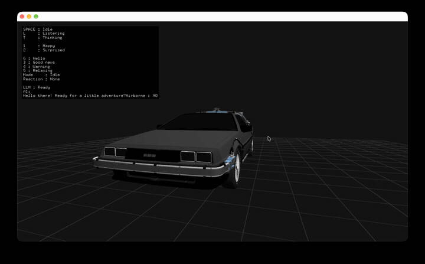

# DeLoreanAI

A fully local, speech-driven AI DeLorean built with openFrameworks.



## Overview

DeLoreanAI is an experimental interactive AI character implemented as an
openFrameworks application.

The application listens to the user's voice, transcribes the speech locally,
generates a response using a local language model, synthesizes speech locally,
and animates a 3D DeLorean character in synchronization with the generated
voice.

No cloud AI API is required during runtime.

## Features

- Fully local AI conversation pipeline
- Microphone-based voice interaction
- Local speech recognition with whisper.cpp
- Local LLM inference with llama.cpp
- Qwen3.5-4B local language model
- Short-term conversation history
- Local text-to-speech with Supertonic 3
- Procedural vehicle animation
- Speech-amplitude-synchronized animation
- Happy / surprised character reactions
- 3D DeLorean rendering with openFrameworks
- Key light and rim light
- Runs without an Internet connection after setup

## Architecture

```text
Microphone
    |
    v
whisper.cpp
    |
    v
Qwen3.5-4B
  llama.cpp
    |
    v
JSON Response
 speech / reaction / intensity
    |
    +---------------------+
    |                     |
    v                     v
Supertonic 3         VehicleAnimator
    |                     |
    v                     |
Generated WAV              |
    |                     |
    +----------+----------+
               |
               v
        DeLorean Character
```

The language model returns a structured response such as:

```json
{
  "speech": "Let's hit the road!",
  "reaction": "happy",
  "intensity": 0.7
}
```

The speech is synthesized locally, while the reaction and intensity are used
to control procedural vehicle animation.

## Current Platform

The current version has been developed and tested on:

- macOS
- Apple Silicon
- Xcode
- openFrameworks

Other platforms have not yet been tested.

## Dependencies

This project uses:

- [openFrameworks](https://openframeworks.cc/)
- ofxAssimpModelLoader
- [llama.cpp](https://github.com/ggml-org/llama.cpp)
- [whisper.cpp](https://github.com/ggml-org/whisper.cpp)
- Supertonic
- ONNX Runtime
- nlohmann-json

llama.cpp, whisper.cpp, and Supertonic are managed as Git submodules.

## Project Location

This project is intended to be placed inside an openFrameworks installation.

For example:

```text
openFrameworks/
└── apps/
    └── myApps/
        └── DeLoreanAI/
```

## Clone

Clone the repository including its submodules:

```bash
git clone --recursive <YOUR_REPOSITORY_URL>
cd DeLoreanAI
```

If the repository was cloned without submodules:

```bash
git submodule update --init --recursive
```

## Homebrew Dependencies

Install the required libraries:

```bash
brew install onnxruntime nlohmann-json
```

ONNX Runtime is used locally by Supertonic.

The current macOS build links ONNX Runtime through:

```text
/opt/homebrew/opt/onnxruntime/
```

so Homebrew is currently required on the target Mac.

## Build llama.cpp

From the project root:

```bash
cd third_party/llama.cpp
./build-xcframework.sh macos
cd ../..
```

This generates the llama.cpp XCFramework used by the Xcode project.

## Build whisper.cpp

```bash
cd third_party/whisper.cpp
./build-xcframework.sh
cd ../..
```

This generates the whisper.cpp XCFramework used by the Xcode project.

## Supertonic C++23 Compatibility Patch

The current openFrameworks project is built with C++23.

A small compatibility patch for Supertonic is included in this repository.

Apply it from the project root:

```bash
git -C third_party/supertonic apply ../../patches/supertonic-cpp23.patch
```

## AI Models

Large AI model files are intentionally not included in this repository.

### Qwen3.5-4B

The current application expects:

```text
Qwen3.5-4B-Q4_K_M.gguf
```

Place it at:

```text
bin/data/llm/Qwen3.5-4B-Q4_K_M.gguf
```

The current implementation uses the Q4_K_M quantization.

### Whisper

Download the Whisper base model using the whisper.cpp model downloader:

```bash
cd third_party/whisper.cpp

mkdir -p ../../bin/data/whisper

sh ./models/download-ggml-model.sh \
base \
../../bin/data/whisper

cd ../..
```

The expected file is:

```text
bin/data/whisper/ggml-base.bin
```

The current application is configured for English speech recognition.

### Supertonic 3

Download the Supertonic 3 ONNX models and voice styles from the official
Supertonic distribution.

Place the files as follows:

```text
bin/data/tts/
├── onnx/
│   ├── duration_predictor.onnx
│   ├── text_encoder.onnx
│   ├── vector_estimator.onnx
│   ├── vocoder.onnx
│   ├── tts.json
│   └── unicode_indexer.json
│
└── voice_styles/
    ├── F1.json
    ├── F2.json
    ├── F3.json
    ├── F4.json
    ├── F5.json
    ├── M1.json
    ├── M2.json
    ├── M3.json
    ├── M4.json
    └── M5.json
```

The current application uses the `M1` voice.

Generated speech is written locally to:

```text
bin/data/tts/output/current.wav
```

## 3D Model

This project uses the following 3D model locally:

**1985 DeLorean DMC-12 Time Machine BTTF**  
Creator: **Ddiaz Design**

Original model page:

[https://sketchfab.com/3d-models/1985-delorean-dmc-12-time-machine-bttf-c6d865257d344523be373f543323ae18](https://sketchfab.com/3d-models/1985-delorean-dmc-12-time-machine-bttf-c6d865257d344523be373f543323ae18)

License shown on the model page:

**CC Attribution-NonCommercial-ShareAlike (CC BY-NC-SA)**

The 3D model itself is **not distributed with this repository**.

Download the model from the original Sketchfab page and place the GLB file at:

```text
bin/data/models/DeLorean.glb
```

The original model description states that the model is based on a CSR2 3D
model. Users should review the original Sketchfab page and its licensing
information before reusing the model.

The DeLorean model visible in `docs/demo.gif` is shown with attribution to the
original creator and is used for this non-commercial project.

This project is an independent personal/research project and is not affiliated
with or endorsed by DeLorean Motor Company, Universal Pictures, or the creators
of Back to the Future.

## Controls

### Voice Conversation

Press:

```text
SPACE
```

to start microphone recording.

Press:

```text
SPACE
```

again to stop recording.

The captured audio is then processed through:

```text
Microphone
    ↓
Whisper
    ↓
Qwen
    ↓
Supertonic
    ↓
DeLorean response
```

### Debug Conversation

Several keyboard shortcuts are also available for testing conversation and
character reactions during development.

## Character Animation

The DeLorean uses procedural animation rather than prerecorded animation.

The vehicle can react through:

- body heave
- pitch
- roll
- yaw
- front-wheel steering
- reaction impulses
- speech-synchronized motion

Character states currently include:

```text
Idle
Listening
Thinking
Speaking
```

Additional reactions include:

```text
Happy
Surprised
```

During speech playback, the generated audio waveform is analyzed and used to
drive the motion amplitude of the vehicle.

## Lighting

The current scene uses simple real-time lighting:

- global ambient lighting
- key light
- rim light

The lighting is designed to emphasize the metallic shape of the DeLorean while
keeping the rendering implementation lightweight.

## Conversation Memory

DeLoreanAI stores a small number of recent conversation turns.

The recent dialogue is inserted into the next Qwen prompt so the character can
respond with short-term conversational context.

The current implementation stores up to three recent turns.

## Offline Operation

After the required models and runtime dependencies have been installed, the
entire AI pipeline runs locally.

```text
Speech Recognition
    → Local

Language Model
    → Local

Text-to-Speech
    → Local

Conversation Memory
    → Local

Character Animation
    → Local
```

The complete pipeline has been tested successfully with Wi-Fi disabled.

No external AI API is required during runtime.

## Local Data Layout

The expected runtime data layout is:

```text
bin/data/
├── llm/
│   └── Qwen3.5-4B-Q4_K_M.gguf
│
├── models/
│   └── DeLorean.glb
│
├── tts/
│   ├── onnx/
│   ├── output/
│   └── voice_styles/
│
└── whisper/
    └── ggml-base.bin
```

## Files Excluded from Git

Large models, generated audio, and third-party 3D assets are intentionally not
stored in this repository.

Examples include:

```text
bin/data/llm/*.gguf
bin/data/whisper/
bin/data/tts/
bin/data/models/DeLorean.glb
```

Users must obtain these assets separately.

## Repository Structure

```text
DeLoreanAI/
├── bin/
│   └── data/
│
├── docs/
│   └── demo.gif
│
├── patches/
│   └── supertonic-cpp23.patch
│
├── src/
│   ├── DeLorean.cpp
│   ├── DeLorean.h
│   ├── LLMEngine.cpp
│   ├── LLMEngine.h
│   ├── TTSEngine.cpp
│   ├── TTSEngine.h
│   ├── VehicleAnimator.cpp
│   ├── VehicleAnimator.h
│   ├── WhisperEngine.cpp
│   ├── WhisperEngine.h
│   ├── ofApp.cpp
│   └── ofApp.h
│
├── third_party/
│   ├── llama.cpp/
│   ├── supertonic/
│   └── whisper.cpp/
│
├── addons.make
├── README.md
└── .gitignore
```

## Current Scope

DeLoreanAI is currently a research / personal development prototype.

The current version focuses on:

- fully local AI inference
- speech-based interaction
- conversational continuity
- real-time character behavior
- speech-synchronized procedural animation
- lightweight 3D rendering and lighting

## Acknowledgements

Thanks to the developers and communities behind:

- openFrameworks
- llama.cpp
- whisper.cpp
- Qwen
- Supertonic
- ONNX Runtime
- Assimp
- ofxAssimpModelLoader

### 3D Model Attribution

**1985 DeLorean DMC-12 Time Machine BTTF**  
by **Ddiaz Design**

Original model:

[Sketchfab — 1985 DeLorean DMC-12 Time Machine BTTF](https://sketchfab.com/3d-models/1985-delorean-dmc-12-time-machine-bttf-c6d865257d344523be373f543323ae18)

Please refer to the original Sketchfab page for the model's licensing and
attribution requirements.
